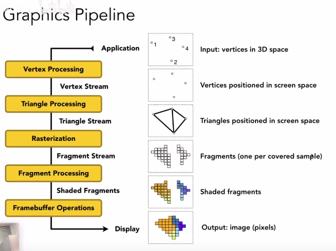

### Lecture3. Transformation
#### 2D变换
+ 缩放矩阵(Scale)
$$
  \left[
 \begin{matrix}
   x'\\
   y'
  \end{matrix}
  \right] = 
  \left[
 \begin{matrix}
   s_x & 0 \\
   0 & s_y
  \end{matrix}
  \right]
  \left[
 \begin{matrix}
   x \\
   y
  \end{matrix}
  \right]
   \tag{1}
$$

+ 反射/对称矩阵(Reflection)
以水平对称为例：
$$
  \left[
 \begin{matrix}
   x'\\
   y'
  \end{matrix}
  \right] = 
  \left[
 \begin{matrix}
   -1 & 0 \\
   0 & -1
  \end{matrix}
  \right]
  \left[
 \begin{matrix}
   x \\
   y
  \end{matrix}
  \right]
   \tag{2}
$$

+ 切片矩阵(Shear)
$$
  \left[
 \begin{matrix}
   x'\\
   y'
  \end{matrix}
  \right] = 
  \left[
 \begin{matrix}
   1 & a \\
   0 & 1
  \end{matrix}
  \right]
  \left[
 \begin{matrix}
   x \\
   y
  \end{matrix}
  \right]
   \tag{3}
$$

+ 旋转变换(Rotate)
$$ R_\theta = 
    \left[
        \begin{matrix}
        cos\theta & -sin\theta \\ 
        sin\theta & cos\theta 
    \end{matrix}
    \right]
    =>
    \left[
        \begin{matrix}
        x' \\ y' 
        \end{matrix}
    \right] = R_\theta 
    \left[
        \begin{matrix}
        x \\ y 
        \end{matrix}
    \right]
    \tag{4}
$$

+ 逆变换(Inverse)
求原先变换矩阵$M$的逆矩阵$M^{-1}$即可。 

#### 齐次坐标
+ 为什么要用齐次坐标？
    + 将各种变换进行统一，可以用统一的矩阵T表示变换矩阵
增加一维：
+ 2D点：$(x, y, 1)^T$，or $(x, y, w)^T = (x/w, y/w, 1)$ 并且 $w!=0$ 
+ 2D向量：$(x, y, 0)^T$,
    + 向量加0是为了保护向量的平移不变性，同时可以区分向量与点，而且向量与点的计算结果类型也得到直观体现(1为点，0为向量)
+ 三维坐标同理

#### 矩阵知识
+ 某矩阵的逆矩阵和转置矩阵相同，则该矩阵为正交矩阵

### Lecture4. 观测变换(Viewing transformation)
#### 视图变换(View/Model transformation)

简而言之是照相机(观察点)的位置
+ Position: $\hat{e}$
+ Look-at: $\hat{g}$
+ Up direction: $\hat{t}$

照相机摆放到原点，并将观察方向指向-Z，Up方向指向Y。

+ 先平移$\hat{e}$到原点
    $$T_{view} = 
        \left[ 
            \begin{matrix}
            1 & 0 & 0 & -x_e \\
            0 & 1 & 0 & -y_e \\
            0 & 0 & 1 & -z_e \\
            0 & 0 & 0 & 1
            \end{matrix}
        \right] $$
+ 旋转观察方向和up方向，直接秋旋转矩阵不好求，但是可以根据正交矩阵逆与转置相同的性质先求旋转的逆矩阵，即：
    $$R_{view}^{-1} = 
        \left[ 
            \begin{matrix}
            x_{\hat{g}\times\hat{t}} & x_{t} & x_{-g} & 0 \\
            y_{\hat{g}\times\hat{t}} & y_{t} & y_{-g} & 0 \\
            z_{\hat{g}\times\hat{t}} & z_{t} & z_{-g} & 0 \\
            0 & 0 & 0 & 1
            \end{matrix}
        \right] 
        => 
        R_{view} = 
        \left[ 
            \begin{matrix}
            x_{\hat{g}\times\hat{t}} & y_{\hat{g}\times\hat{t}} & z_{\hat{g}\times\hat{t}} & 0 \\
            x_{t} & y_{t} & z_{t} & 0 \\
            x_{-g} & y_{-g} & z_{-g} & 0 \\
            0 & 0 & 0 & 1
            \end{matrix}
        \right]
    $$

相机移动之后，模型也需要根据这些矩阵移动到相对应的位置，以保持和相机的相对位置不变。
#### 投影变换(projection transformation)

##### 正交投影(Orthographic projection)

##### 透视投影(Perspective projection)
透视投影->正交投影，+正交投影就得到了透视投影

假设相机在原点，近景z坐标为n，远景z坐标为f。如何挤压远景得到和近景等大的正交投影的画面
+ 挤压后近景完全不变，而远景的x、y坐标与近景一致，z坐标不变。

根据相似三角形的对应关系得到最终挤压矩阵$M_{persp->ortho}$:
$$ M_{persp->ortho} = 
    \left[
        \begin{matrix}
        n & 0 & 0 & 0 \\
        0 & n & 0 & 0 \\
        0 & 0 & n+f & -nf \\
        0 & 0 & 1 & 0 \\
        \end{matrix}
    \right]
$$
$ => M_{persp->ortho}*M_{persp} = M_{ortho}$

### Lecture5/6. Rasterization(光栅化)/Antialiasing(反采样/抗锯齿)
光栅化：简而言之就是将图形空间里的models采样到二维图像里，并通过以希望物理设备进行展示，也就是现在的各类显示器。

锯齿：由于采样->光栅化这个过程中的最小单位是像素，是从连续到不连续，因此采样的结果与实际有区别，常常会形成锯齿。因此需要技术来解决这个问题，即抗锯齿。

由傅立叶变换可知，任意函数可以转换为许多不同频率的信号之和，因此对于不同频率的信号不能使用相同频率的采样方法，否则采样的结果会与实际差距太大。

走样：不同频率的函数的采样结果无法区分（说明采样频率有问题），因此出现走样。

+ 时域的卷积==频域的乘积
+ 高通滤波求边界，低通滤波模糊

#### 反采样的方法
+ 增加采样率：像素小，采样率更高
    + 这是物理限制。
+ 采样前模糊(Pre-Filter)：没有改进判断单个像素颜色的方法，而是对图形进行模糊处理
    + 如何模糊：低通滤波器过滤掉高频波-->各种滤波器
    + 结果：效果还可以，先采样后模糊不行
+ 超采样：对单个像素进行多点采样，再将采样结果进行卷积（也就是平均/滤波），就可以实现更精准的模糊效果

#### z-buffer
+ 复杂度：O(n)，n是三角形的个数
+ 可能不只是对每个像素操作，而是对每个采样点操作，比如超采样
+ 处理不了透明物体，因为有$\alpha$

### Lecture7/8/9. Shading
#### Illumination & Shading
##### Blinn-Phong着色模型：ambient(环境光) + diffuse(漫反射) + specular(高光)
+ 1.基础定义：
    + 视点向量：v
    + 光源向量：l
    + 物体法线向量：n
+ 2.Lambert's余弦定律：$cos\theta = l \cdot n$
+ 3.点光源的传播随距离增加而衰减，$r^2$级
+ 结合1/2/3 =>
    + 反射出去的值diffuse: $L_d = k_d(L_i/d^2)max(0, n \cdot l)$
    + $k_d$: 材料本身的漫反射系数，表示为(r,g,b)的三通道color值
    + $L_i$: 光的颜色
    + 与观察方向v无关，漫反射向各方向的反射相同
+ 4.关于高光的定义
    + 镜面反射方向向量: R
    + 半程向量: h ($h = \frac{v+l}{||v+l||}$)
+ 5.半程向量h与法线向量n是否接近
+ 结合4/5 =>
    + 镜面反射(高光)specular: $L_s = k_s(L_i/r^2)max(0, n \cdot h)^p$
    + $k_s$: 材料本身的漫反射系数，表示为(r,g,b)的三通道color值
    + $L_i$: 光的颜色
    + $p$: 因为实际高光区域很小，仅仅是余弦不足以表现真实的高光，一般在100~200
+ 环境光照ambient：$L_a = k_aI_a$
    + $k_a$: 材料本身的漫反射系数，表示为(r,g,b)的三通道color值
    + $L_a$: 光的颜色
    + 不考虑光线方向、观察方向、法线方向
    + 真正的全局光照非常复杂，这里是大胆假设，简化了模型
+ 结合ambient + diffuse + specular => 
    + $L = L_a + L_d + L_s$

##### Shading频率
+ Flat Shading: 每个三角面一个法线向量，面的颜色处理的一模一样
    + 效果较差
+ Gouraud shading
    + 求出所有顶点法线向量，计算出各顶点颜色值
        + 各面求和或加权求和，再归一化
    + 三角形内的点通过顶点颜色值作插值得到(即不用求法线向量)
+ Phong Shading：逐像素
    + 求出所有顶点法线向量，计算出各顶点颜色值
    + 三角形内的像素点的法线向量通过顶点法线向量作插值得到，再计算颜色值(即要求法线向量)
    + 逐像素着色

#### Grahics Pipeline(图形管线)

+ Vertex Shader: 顶点着色器
+ Fragment Shader: 像素/片段着色器

#### Texture Mapping(纹理映射)
+ 纹理放大：
    + 双线性插值
    + 双立方（三次）插值
        + 效果更好，开销更大

+ Mipmap
    + 快速的、近似的、方形的范围查询
    + 根据原纹理计算出更小分辨率的纹理
    + 计算level D的Mipmap:
        + $L = max(\sqrt{(\frac{du}{dx})^2 + (\frac{du}{dy})^2}, \sqrt{(\frac{dv}{dx})^2, (\frac{dv}{dy})^2})$
        + $D = log_2L$
    + 现在的查询是离散的，无法计算类似1.2层的结果。因此有三线性插值的方法，实现比较连续的插值结果
        + 1.在D层求插值
        + 2.在D+1层求插值
        + 3.求层与层的插值
+ Anisotropic Filter(各向异性过滤)
    + Mipmap只能处理正方形的纹理缩小，而各向异性过滤可以对不同的维度采取不同的缩小策略
##### 插值
+ 线性插值：$lerp(x, v_0, v_1) = v_0 + x(v_1-v_0)$
+ 双线性插值：
    + $u_0 = lerp(s, u_{00}, u_{10})$
    + $u_1 = lerp(s, u_{01}, u_{11})$
    + $f(x, y) = lerp(t, u_0, u_1)$
#### 重心坐标
+ 三角形内任一点$(x, y) = \alpha A + \beta B + \gamma C, \alpha+\beta+\gamma=1, \alpha >=0 \beta>=0, \gamma>=0$
+ 重心：$\alpha = \beta = \gamma = 1/3$

+ 结合重心坐标可以实现各种插值，颜色、纹理坐标、法线向量等等。
+ 三维空间中需要先计算插值再投影
+ 投影之后没有不变性，这是缺点

### Lecture10/11/12. Geometry
### Lecture13/14/15/16. Ray Tracing
### Lecture17. Materials and Appearances
### Lecture18. Advanced Topics in Rendering
### Lecture19. Cameras, Lenses and Light Fields
### Lecture20. Color and Perception
### Lecture21/22. Animation